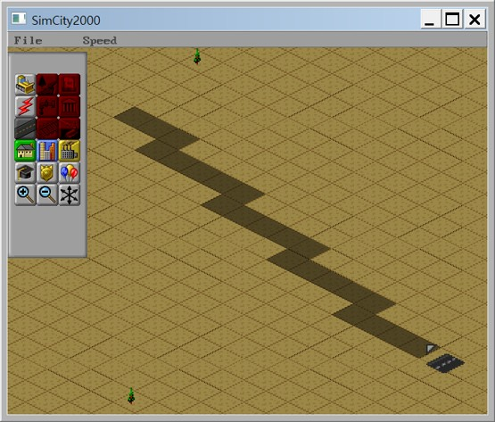
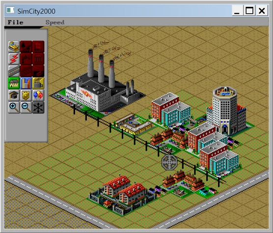

# 🏙️ SimCity 2000 모작

🛠️ **개발 도구**
  

📅 **개발 기간**
2024.11.15 ~ 2024.11.25 (약 2주)

아이소매트릭 뷰 도시 건설 시뮬레이션 SimCity 2000을 모작한 프로젝트입니다.

---

## 🛠️ 주요 구현 요소
<table>
  <tr>
    <td align="center"><strong>도로, 전기선, 구역, 건물 생성</strong></td>
    <td align="center"><strong>전력, 도로 공급시 구역 건물 생성</strong></td>
  </tr>
  <tr>
    <td></td>
    <td></td>
  </tr>
</table>

- **SFML 프레임워크 제작**
  - 게임 루프, 씬 시스템, 이벤트 처리 등의 구조를 직접 구현
  - 부모-자식 관계에 따라 계층적으로 적용되는 **계층 트랜스폼** 구현 👉 [Transform.h](https://github.com/KALI-UM/SFML-SimCity2000/blob/master/SFML_SimCity2000/Framework/Transform.h)

- **타일 시스템 설계**
  - **월드 좌표 → 타일 좌표 변환**으로 현재 타일 검출 👉 [TileView.cpp](https://github.com/KALI-UM/SFML-SimCity2000/blob/master/SFML_SimCity2000/Tile/TileView.cpp#L69)
  - **브레젠험 직선 알고리즘**으로 직선 도로 건설 👉 [TileController.cpp](https://github.com/KALI-UM/SFML-SimCity2000/blob/master/SFML_SimCity2000/Tile/TileController.cpp#L342)
